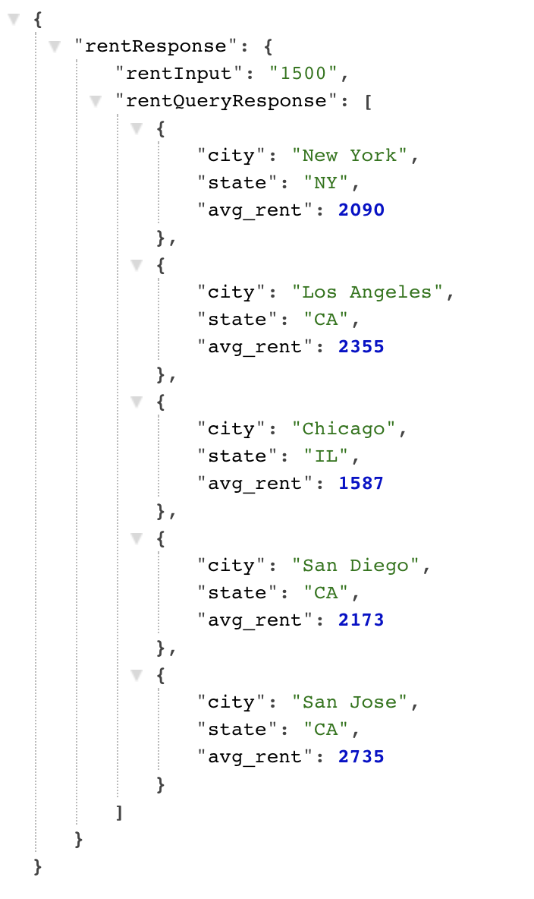
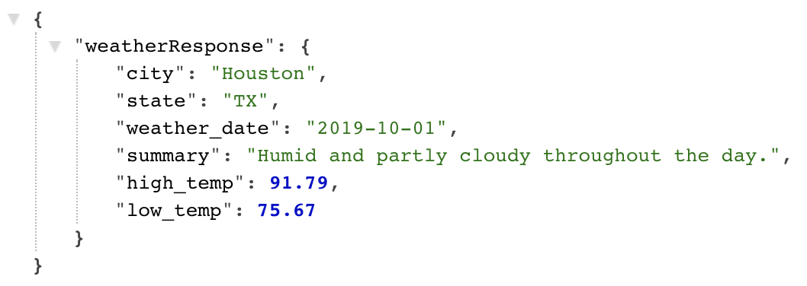

<h1>Where Should I Live API</h1>

<h2>About</h2>
This API allows a user to query rent and weather conditions for different cities within the US.

<h2>Rent</h2>

<b><h3>Rent query string</h3></b>

<i>/rent?rent=&compare=greater/less&quantity=&key=API_KEY</i>

<b><h3>Parameters</h3></b>

<b>rent</b> 
The rent amount you would like to compare against. This amount must be an integer.  

<b>compare</b> 
Returns the cities greater or less than rent amount. User must input greter or less.  

<b>quantity</b> 
The number of citites returned in result. This amount must be an integer.  

<b>key</b> 
Private key availabe upon request.

<h3>Rent Example Query (ran locally)</h3> 
http://localhost:PORT/rent?rent=1500&compare=greater&quantity=5&key=API_KEY

<b><h3>Rent Result</h3></b>

<h2>Weather</h2>

<b><h3>Weather query string</h3></b>

<i>/weather?city=&state=&weather_date=&key=API_KEY</i>

<b><h3>Parameters</h3></b>

<b>city</b> 
City you would like to query. This must be a string.  

<b>state</b> 
State of city you would like query. This must be a string.  

<b>weather_date</b> 
The specific date you would like to query. This must be a valid date sent in YYYY-MM-DD format.  

<b>key</b> 
Private key availabe upon request.

<h3>Weather Example Query (ran locally)</h3> 
http://localhost:PORT/weather?city=Houston&state=TX&weather_date=2019-10-01&key=API_KEY

<b><h3>Weather Result</h3></b>

